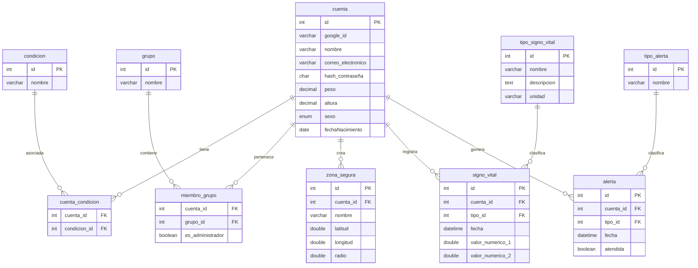

# ProtectVida

ProtectVida es una aplicación que aprovecha el protocolo de comunicación BLE para conectarse con reojes inteligentes y otros dispositivos con el fin de ofrecer un monitoreo continuo sobre la salud. Los datos como la oxigenación en sangre, ritmo cardíaco y presión arterial se analizan para detectar posibles anomalías y generar alertas automáticas a familiares cercanos en caso de emergencia.

- Monitoreo de signos vitales: Realiza un ánalisis de los signos vitales con el fin de generar un analisis y alertas.
- Areas seguras: Configuración de áreas seguras para tener un monitoreo de los usuarios y generando notificaciones.
- Grupos: Creación de grupos familiares para un monitoreo compartido, permitiendo el acceso a información en tiempo real sobre el estado de salud de los integrantes.
- Notificaciones personalizadas: Configuración personalizada de alertas según el tipo, miembro, étc.

## Diagrama ER
